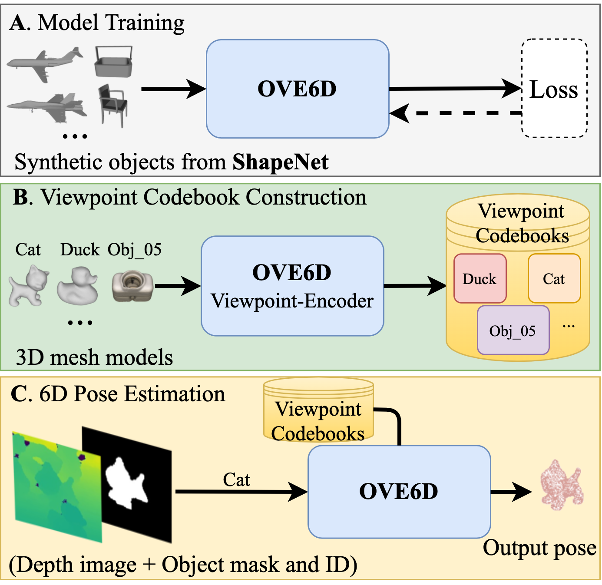

# OVE6D: Object Viewpoint Encoding for Depth-based 6D Object Pose Estimation (CVPR 2022)
- [Project page](https://dingdingcai.github.io/ove6d-pose/) [Paper](https://arxiv.org/abs/2203.01072)

    

## Setup
Please start by installing [Miniconda3](https://conda.io/projects/conda/en/latest/user-guide/install/linux.html) with Pyhton3.8 or above.

## Denpendencies
This project requires the evaluation code from [bop_toolkit](https://github.com/thodan/bop_toolkit) and [sixd_toolkit](https://github.com/thodan/sixd_toolkit).

## Dataset
Our evaluation is conducted on three datasets all downloaded from [BOP website](https://bop.felk.cvut.cz/datasets). All three datasets are stored in the same directory. e.g. ``Dataspace/lm, Dataspace/lmo, Dataspace/tless``.

## Quantitative Evaluation
Evaluation on the LineMOD and Occluded LineMOD datasets with instance segmentation (Mask-RCNN) network (entire pipeline i.e. instance segmentation + pose estimation)

``python LM_RCNN_OVE6D_pipeline.py`` for LineMOD.

``python LMO_RCNN_OVE6D_pipeline.py`` for Occluded LineMOD.

Evaluation on the T-LESS dataset with the provided object segmentation masks (downloaded from [Multi-Path Encoder](https://github.com/DLR-RM/AugmentedAutoencoder/tree/multipath)).

``python TLESS_eval_sixd17.py`` for TLESS.

## Training
To train OVE6D, the ShapeNet dataset is required. You need to first pre-process ShapeNet with the provided script in ``training/preprocess_shapenet.py``, and [Blender](https://www.blender.org/) is required for this task. More details refer to [LatentFusion](https://github.com/NVlabs/latentfusion).

## pre-trained weight for OVE6D
Our pre-trained OVE6D weights can be found [here](https://drive.google.com/drive/folders/16f2xOjQszVY4aC-oVboAD-Z40Aajoc1s?usp=sharing). Please download and save to the directory ``checkpoints/``.

## Segmentation Masks
- 1. For T-LESS we use the [segmentation masks](https://dlrmax.dlr.de/get/c677b2a7-78cf-5787-815b-7ba2c26555a7/) provided by [Multi-Path Encoder](https://github.com/DLR-RM/AugmentedAutoencoder/tree/multipath).
- 2. For LineMOD and Occluded LineMOD, we fine-tuned the Mask-RCNN initialized with the weights from [Detectron2](https://github.com/facebookresearch/detectron2). The training data can be downloaded from [BOP](https://bop.felk.cvut.cz/datasets).

# Acknowledgement
- 1. The code is partially based on [LatentFusion](https://github.com/NVlabs/latentfusion).
- 2. The evaluation code is based on [bop_toolkit](https://github.com/thodan/bop_toolkit) and [sixd_toolkit](https://github.com/thodan/sixd_toolkit).
